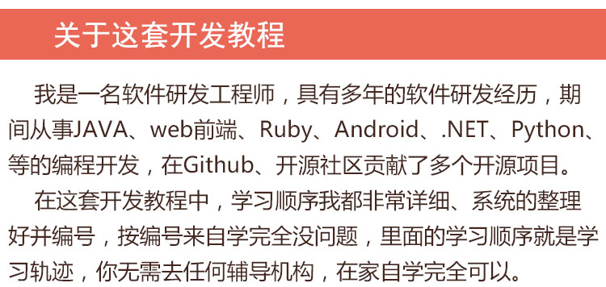
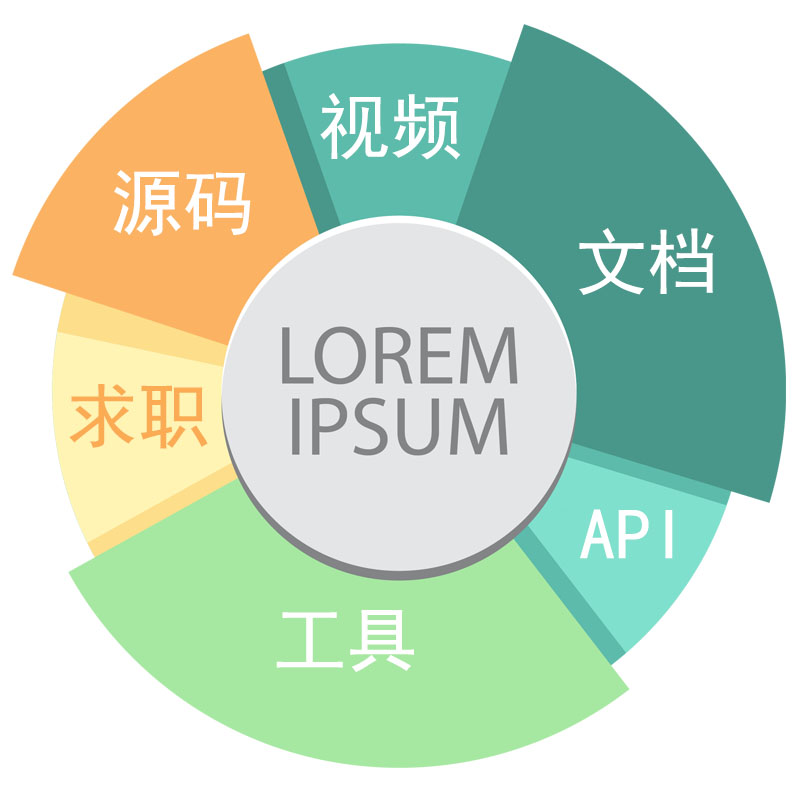
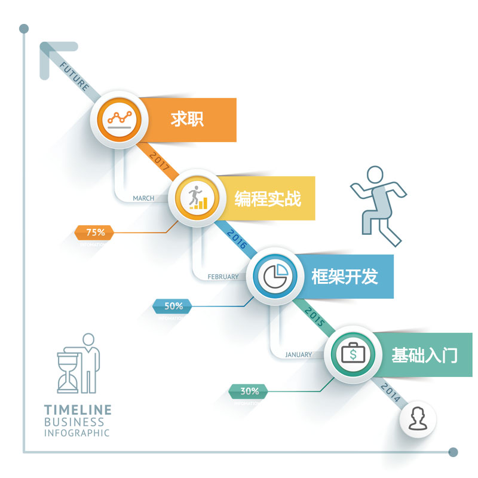

# 全套最新Linux视频教程
    
     
## 1Linux基础知识视频教程--12G--[目录大纲](1Linux基础知识.md)

> 网盘地址: 链接：https://pan.baidu.com/s/1wmG\_AW0Ij5Q-5RWzcjHlqQ 提取码：7iy7

## 2.Linux系统管理视频教程--3.0G--[目录大纲](2.Linux系统管理.md)

> 网盘地址: 链接：https://pan.baidu.com/s/1iPQcv4F4B8Gf9o-hWO3jYg 提取码：lb79

## 3.Shell编程视频教程--4.5G--[目录大纲](3.Shell编程.md)

> 网盘地址: 链接：https://pan.baidu.com/s/1-M4wHTMaE8rxjroTTd-9qQ 提取码：qf52

## 4.Linux网络服务管理视频教程--17G--[目录大纲](4.Linux网络服务管理.md)

> 网盘地址: 链接：https://pan.baidu.com/s/1fI-9MOiD8Q6sJIsaqsLaEw 提取码：44yi

## 5.MySQL数据库管理视频教程--3.7G--[目录大纲](5.MySQL数据库管理.md)

> 网盘地址: 链接：https://pan.baidu.com/s/1pPqoo7DM9Me7m65DlPWtsQ 提取码：ioao

## 6.Linux集群视频教程--20G--[目录大纲](6.Linux集群.md)

> 网盘地址: 链接：https://pan.baidu.com/s/1roYoSM0jHqa3PrCfaaaqUQ 提取码：41py

## Linux运维-大厂经典面试题视频教程--3.7G--[目录大纲](Linux运维-大厂经典面试题.md)

> 网盘地址: 链接：https://pan.baidu.com/s/1\_fWm9vFuTigxrC5JiP1nJA 提取码：g8lp

